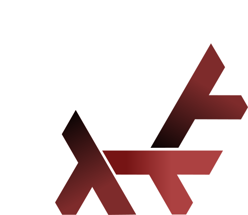

<h1 align="center">
  My NixOS Configuration Files
</h1>



<br>

<br>

These are my NixOS Configuration Files that I use daily on my current machines.
I have been messing with NixOS, Home Manager, and Flakes since Fall of 2023.
Below I will include the different hosts that I have inside this configuration.
As well as any specifics That might be useful for someone looking at my setup.
Feel free to copy or adjust any of my dot files, I can't promise it will work
but I wish you the best of luck.

<br>

<br>

<br>

<br>

## Hosts

| Hostname | Device Type    | Purpose  | CPU                  | GPU             | MEM        | DE       |
| -------- | -------------- | -------- | -------------------- | --------------- | ---------- | -------- |
| Azami    | Laptop         | School   | Intel i7-1255U       | Integrated      | 16 GB DDR5 | Hyprland |
| Deimos   | Desktop        | Gaming   | Ryzen 5 5600X        | Nvidia 3070 LHR | 32 GB DDR4 | Hyprland |
| Vigil    | Raspberry Pi 4 | Anything | Quad core Cortex-A72 | VideoCore VI 3D | 2 GB DDR4  | None     |

<br>

## Flake Inputs

- Nixos Hardware

[nixos-hardware](https://github.com/NixOS/nixos-hardware.git) is a collection of
NixOS Modules for covering hardware quirks. Due to me deciding to buy a
Microsoft Surface before knowing better, I tend to need many specific drivers
for my system. The main issue that prompted me in finding a fix was the laptop
failing to power off fully and the screen flickering randomly. Adding this to my
flake inputs and a few lines of Config to my flake modules
[here](https://github.com/Steven-S1020/Nixos-Configuration/blob/e0d55644fd67f45364d4b5bd64139e7b2ba4f110/flake.nix#L27-L28)
mostly fixed the issue. (I later realized the screen flickering was due to
Microsoft not knowing how to make Laptops even though it's kinda their job.)

<br>

- Den

[den](https://github.com/vic/den),
[flake-aspects](https://github.com/vic/flake-aspects),
[flake-file](https://github.com/vic/flake-file),
[flake-parts](https://github.com/hercules-ci/flake-parts),
[import-tree](https://github.com/vic/import-tree),
[systems](https://github.com/nix-systems/default), these inputs are also used
for how the current structure of my NixOS config. I will go into more detail
later.

<br>

- Stylix

[stylix](https://github.com/danth/stylix.git) is a system wide theming module
for NixOS. My main reason for this was due to my obsession with the color red
and that there isn't many good red standardized themes for linux. After adding
this input to my flake and modules, all I needed to do was create a new config
file
[here](https://github.com/Steven-S1020/Nixos-Configuration/blob/e0d55644fd67f45364d4b5bd64139e7b2ba4f110/Modules/Configs/stylix.nix)

<br>

- NVF

[NVF](https://github.com/notashelf/nvf) provides a nixos and home-manager module
for declaratively configuring neovim.

<br>

- Noctalia

[noctalia](https://github.com/noctalia-dev/noctalia-shell) and
[noctalia-qs](https://github.com/noctalia-dev/noctalia-qs) is a customizable
quickshell configuration with many options and plugins. It replaces many
different apps programs that I would need to install and configure otherwise.

<br>

- Mkdev

[mkdev](https://github.com/4jamesccraven/mkdev.git) is a command line tool to
copy and deploy frequently used scripts and projects. Not only is this made by
one of my friends, but I use it daily for quickly creating new projects. This in
combination with [ultisnips](https://github.com/SirVer/ultisnips.git) speeds up
my coding workflow.

<br>

- Zen Browser

[zen-browser](https://github.com/youwen5/zen-browser-flake.git) is a new browser
that isn't in nixpkgs yet. I've been keeping an eye on it since it launched, but
it's taking longer than expected to reach a stable build for nixpkgs.

<br>

## Den Framework/Library

I would like to first note that I'm very new to using a dendritic type framework
for my NixOS configuration as well as I will be structuring my configuration in
the way that makes the most sense to me.

The Den framework/library works by using many different modules that are
independent of themselves. These modules are mostly called aspects. For example
I have one file that defines `den.aspects.git`, this aspect then can have three
main sections, `nixos`, `homeManager,` and `includes`. `nixos` is where you set
nixos options, `homeManager` is an alias for `users.users.<username>` thus you
set home-manager options here, and `includes` is where you can include other
modules or define context specific settings. Den uses the term context to create
specific settings based on some provided context like `host` or `user`. To tell
Den that an aspect is going to need to supply context you will include
`den.lib.parametric` when defined said aspect. Next you will designate in the
`includes` block what context you need like `{ host, ... }` or `{ host, user }`
and how you need it like `den.lib.take.exactly` or `den.lib.take.atLeast`. This
tells Den to only evaluate this block when you have exactly or at least this
context.

## Personal Notes

### Installation :

```
cd /etc/nixos
sudo chown -R steven:steven .
nix-shell -p git --run "git clone git@github.com:Steven-S1020/Nixos-Configuration.git ."
sudo nixos-rebuild switch --flake #<FlakeHost>
```

<br>

### Updating :

For all inputs:

```
cd etc/nixos
nix flake update
```

For specific inputs:

```
cd etc/nixos
nix flake update <InputName>
```
